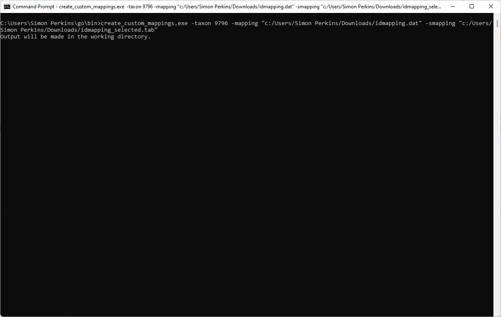
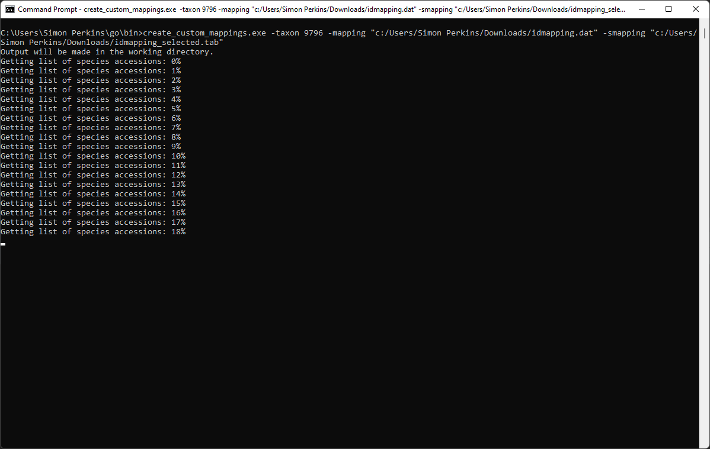
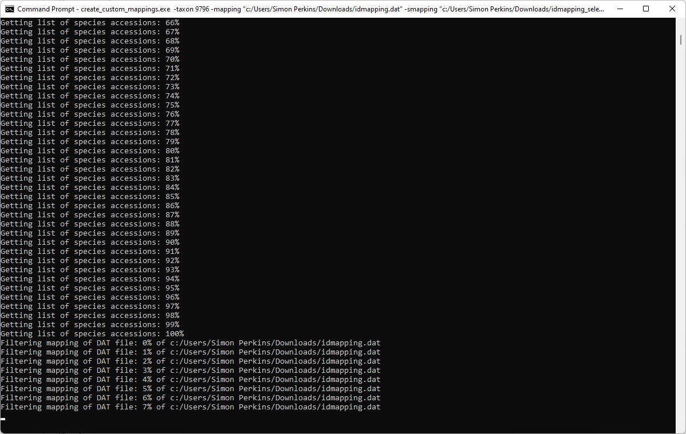
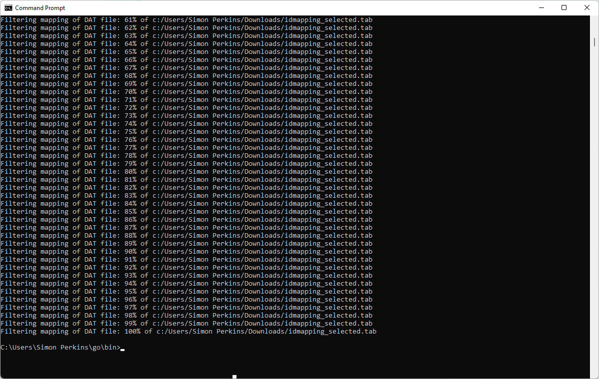

# Mapping & Enrichment

Mapping and enrichment of uniprot accessions for "uncommonly"" used species.

## Mapping with Files

You can use uniprot ID mapping files to map between various identifiers. You may use them to map accessions to orthologous accessions (i.e. probably human). You will first need to run the Go code/executable to filter the uniprot mapping files down to just those entriesd pertaining to your species of interest. There were R and then Python versions of this code but they were too slow.

### Go Console Application
You may build the GO console application from source or you just run it. The executable (compiled for Linux) is in the 'simon/mapping_enrichment' folder of the HC storage CBF space - others will be able to direct you to this.
You provide the path to idmapping.dat(.gz) and idmapping_selected.tab(.gz), and an NCBI taxon ID or file of accessions for which you want mapping data.

This first image shows the command being called with a mapping file, a selected mapping file, and an NCBI taxon ID.

It will complain if you miss something that it needs. In the next image it is scanning through to find accessions that match your NCBI taxon ID.

When it has gathered a list of accessions it will go about filtering your input mapping files...

...

Until finally it has finished! It may take a long time, so try not to do this very often, and maybe do it on the cluster of similar high performance machine.

### R/Python Scripts
There is a Python script and R code for filtering the mapping data but is is very slow - only use these if you absolutely have to!

To run the R script see 'filterIdData' in 'mapping_with_files.R' for the deprecated function.

To run the Python script, edit 'create_custom_mapping_files.py' to set the correct paths for the mapping files, NCBI taxon ID or accessions file path. Then run the script like any other Python script, in your IDE of choice or on the console. The Python code for this is in a much better state than the R code but still slow.

After running the Go application or the R/Python scripts, you can use the mapping data however you like once you read it into R/Python. The enrichment section below goes into this.

## Mapping with 'db_ortho'
If you are looking to map to orthologues then as mentioned above you can try out the db_ortho web service. I have my wrapper function in 'mapping_with_db_ortho.R'. To learn the different types of input ID types and output ID types, and species for which you can map to with your IDs, check out the db_ortho website.

## Enrichment
If the mappings are used to map IDs to a particular ontology, then enrichment analysis can be performed upon those ontology terms.

 
